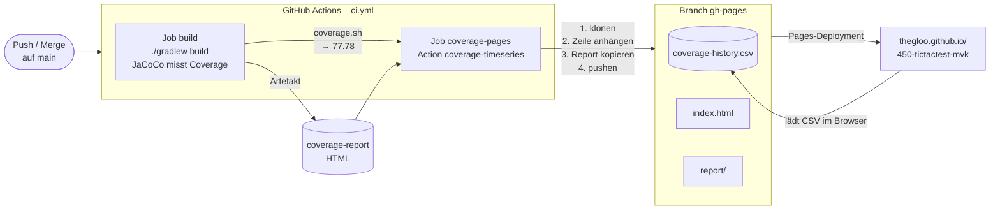
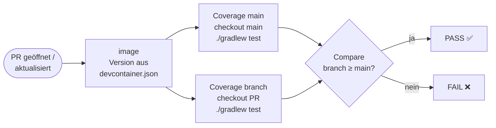

# Test Coverage mit JaCoCo und GitHub Actions (M450)

Dieses Dokument beschreibt, wie im Projekt `450-tictactest-mvk` die Test Coverage
gemessen, über die Zeit verfolgt und bei Pull Requests abgesichert wird.

| Auftrag | Inhalt | Umsetzung |
|---|---|---|
| 1 | Coverage Report für jeden Branch | JaCoCo in [`build.gradle`](../build.gradle), Artefakt `coverage-report` in [`ci.yml`](../.github/workflows/ci.yml) |
| 2 | Design der Coverage Time-Series | [Kapitel 2](#2-auftrag-2-design-der-coverage-time-series) |
| 2.5 | Implementation der Time-Series auf GitHub Pages | Job `coverage-pages` in `ci.yml` + eigene Action [`coverage-timeseries`](../.github/actions/coverage-timeseries/action.yml) (Bonus) |
| 3 | Coverage Gate für Pull Requests | [`coverage-gate.yml`](../.github/workflows/coverage-gate.yml) |

**Time-Series:** <https://thegloo.github.io/450-tictactest-mvk/>

---

## 1. Auftrag 1: Coverage Report

### JaCoCo im Build

In [`build.gradle`](../build.gradle) ist das Gradle-Plugin `jacoco` eingebunden
(`toolVersion 0.8.15`, weil erst ab 0.8.14 Klassen von Java 25 instrumentiert
werden können). Der Task `test` wird mit `finalizedBy jacocoTestReport` abgeschlossen,
jeder Testlauf erzeugt also automatisch den Report:

```bash
./gradlew test        # oder ./gradlew build
```

| Datei | Zweck |
|---|---|
| `build/reports/jacoco/test/html/index.html` | HTML-Report für Menschen |
| `build/reports/jacoco/test/jacocoTestReport.csv` | Grundlage für Time-Series und Gate (eine Zeile pro Klasse) |
| `build/reports/jacoco/test/jacocoTestReport.xml` | Standardformat für Werkzeuge (z. B. *Coverage Gutters* im DevContainer) |

### In der Pipeline

Der CI-Workflow läuft bei **jedem Push auf jeden Branch**, bei Pull Requests auf
`main` und manuell. Der Job *Build, Test & Coverage*

1. führt mit `./gradlew build` alle Tests aus, dabei misst JaCoCo die Coverage,
2. schreibt Line-, Branch- und Instruction-Coverage in die Zusammenfassung des Laufs,
3. lädt den vollständigen HTML-Report als Artefakt **`coverage-report`** hoch
   (Actions → Lauf → *Artifacts*).

### Abnahmekriterien

| Kriterium | Erfüllt durch |
|---|---|
| JaCoCo ist im Projekt eingebunden | Plugin `jacoco` in `build.gradle` |
| Tests laufen über GitHub Actions | `ci.yml`, Schritt *Build and run tests* |
| ein Coverage Report wird erstellt | `jacocoTestReport` (HTML, XML, CSV) |
| der Report entsteht für jeden Branch | Trigger `push: branches-ignore: [gh-pages]` |
| der HTML-Report ist als Artefakt verfügbar | Artefakt `coverage-report` |

---

## 2. Auftrag 2: Design der Coverage Time-Series

> Der Auftrag sieht vor, das Design **zu zweit** zu erarbeiten und im Plenum
> vorzustellen. Dieses Kapitel hält das Ergebnis fest, das umgesetzt wurde.

### Die Fragen aus dem Auftrag

| Frage | Entscheid | Begründung |
|---|---|---|
| **Woher kommt der aktuelle Coverage-Wert?** | Aus dem CSV-Report von JaCoCo (`jacocoTestReport.csv`), den der CI-Job ohnehin erzeugt. Das Skript [`coverage.sh`](../.github/scripts/coverage.sh) summiert die Spalten `LINE_MISSED` und `LINE_COVERED` über alle Klassen. | Kein zusätzlicher Testlauf, keine externe Plattform. Das CSV lässt sich mit `awk` auswerten, ohne XML-Parser. |
| **Welche Metrik?** | **Line Coverage** in Prozent, zwei Nachkommastellen. | Anschaulich („wie viele Codezeilen wurden ausgeführt") und stabil. Instruction Coverage reagiert auf Compiler-Details, Branch Coverage hat bei kleinem Code wenige Messpunkte. Branch und Instruction erscheinen zusätzlich in der CI-Zusammenfassung. |
| **Wo und in welchem Format liegen die historischen Daten?** | Datei `coverage-history.csv` auf dem Branch **`gh-pages`** im selben Repository. | Die Historie liegt versioniert direkt neben der Seite, die sie anzeigt. Keine Datenbank, kein Secret, und jede Änderung ist ein nachvollziehbarer Commit. |
| **Wie kommen neue Messwerte dazu?** | Der Job klont `gh-pages`, hängt **eine Zeile** an und pusht. Ist der Commit schon enthalten (Re-run), wird nichts angehängt. | Nur anhängen, nie überschreiben: Die Historie bleibt erhalten. Eine `concurrency`-Gruppe verhindert, dass zwei gleichzeitige Läufe sich gegenseitig eine Zeile überschreiben. |
| **Wie entsteht daraus eine Time-Series?** | Eine statische `index.html` lädt das CSV im Browser und zeichnet es mit Chart.js als Liniendiagramm, dazu aktueller Wert, Veränderung und Tabelle aller Messungen. | Die Seite muss nie neu generiert werden, das CSV ist die einzige Datenquelle. |
| **Wie wird die Visualisierung veröffentlicht?** | GitHub Pages, Quelle *Deploy from a branch* → `gh-pages` / `(root)`. | Jeder Push auf `gh-pages` löst automatisch das Deployment aus. |
| **Wann wird die Seite aktualisiert?** | Bei **jedem Push auf `main`** (also auch nach jedem Merge eines Pull Requests), sobald Build und Tests grün sind. | Die Time-Series zeigt den Verlauf von `main`. Feature-Branches erzeugen nur ihren Report als Artefakt. |

### Datensatz

`coverage-history.csv`, eine Zeile pro Commit auf `main`:

```text
Datum,Commit,Coverage
2026-09-22T19:14:23Z,c4c7620a307e854c123b45e7f93919e8501f162e,77.78
2026-09-23T08:02:51Z,5b1e0d4f...,78.40
```

| Spalte | Inhalt |
|---|---|
| `Datum` | Zeitpunkt der Messung, ISO 8601 in UTC. Mit Uhrzeit, weil an einem Tag mehrere Merges möglich sind. |
| `Commit` | vollständiger SHA des gemessenen Commits auf `main` (auf der Seite verlinkt) |
| `Coverage` | Line Coverage in Prozent |

### Architektur



---

## 3. Auftrag 2.5: Implementation der Time-Series

### Ablauf bei einem Push auf `main`

1. **Job `build`** (im DevContainer-Image): `./gradlew build`, dann
   `coverage.sh` → Job-Output `coverage`, z. B. `77.78`. Der HTML-Report wird als
   Artefakt `coverage-report` hochgeladen.
2. **Job `coverage-pages`** (nur bei `push` auf `main`, `permissions: contents: write`):
   lädt das Artefakt herunter und ruft die eigene Action auf:

   ```yaml
   - uses: ./.github/actions/coverage-timeseries
     with:
       coverage: ${{ needs.build.outputs.coverage }}
       report-dir: coverage-report
   ```

3. Der Push auf `gh-pages` löst das Pages-Deployment aus (Workflow
   *pages-build-deployment*, von GitHub verwaltet).

### Eigene GitHub Action (Bonus 4.1)

[`.github/actions/coverage-timeseries`](../.github/actions/coverage-timeseries/action.yml)
ist eine *Composite Action*. Sie ist unabhängig von Gradle und JaCoCo, sie braucht nur
den Coverage-Wert:

| Input | Standard | Bedeutung |
|---|---|---|
| `coverage` | – (Pflicht) | Coverage in Prozent |
| `report-dir` | leer | HTML-Report, der unter `/report` veröffentlicht wird |
| `commit` | `github.sha` | Commit, zu dem der Wert gehört |
| `branch` | `gh-pages` | Pages-Branch, der auch die Historie speichert |
| `history-file` | `coverage-history.csv` | Name der CSV-Datei |
| `token` | `github.token` | Token mit `contents: write` |

Output: `page-url`, die Adresse der veröffentlichten Seite.

Die Action

- legt den Branch `gh-pages` beim ersten Lauf selbst an,
- prüft den Wert (nur Zahlen) und hängt pro Commit höchstens eine Zeile an,
- aktualisiert `index.html` (Vorlage: [`index.html`](../.github/actions/coverage-timeseries/index.html)),
  `.nojekyll` und den HTML-Report unter `/report`,
- committet als `github-actions[bot]` und pusht.

### Die Seite

<https://thegloo.github.io/450-tictactest-mvk/> zeigt

- die aktuelle Coverage mit Commit und Zeitpunkt,
- die Veränderung gegenüber dem vorherigen Commit in Prozentpunkten,
- das Liniendiagramm über alle Messungen (Tooltip mit Datum, Wert und Commit),
- eine Tabelle aller Messungen und Links zum aktuellen JaCoCo-Report und zum CSV.

### Abnahmekriterien

| Kriterium | Erfüllt durch |
|---|---|
| bei Änderungen auf `main` wird die Coverage ermittelt | `ci.yml` läuft bei `push` auf `main`, Job `build` |
| der aktuelle Wert wird zur Historie hinzugefügt | Action hängt eine Zeile an `coverage-history.csv` an |
| die historische Entwicklung bleibt erhalten | Historie liegt versioniert auf `gh-pages`, es wird nur angehängt |
| eine Time-Series wird dargestellt | Liniendiagramm in `index.html` |
| die Visualisierung ist über GitHub Pages erreichbar | Pages-Quelle `gh-pages` |

---

## 4. Auftrag 3: Coverage Gate für Pull Requests

**Regel: Ein Branch darf keine tiefere Test Coverage haben als der aktuelle `main`-Branch.**

Workflow: [`coverage-gate.yml`](../.github/workflows/coverage-gate.yml), Name *Coverage Gate*.

| | |
|---|---|
| **Auslöser** | `pull_request` auf `main` mit den Typen `opened`, `synchronize` (neuer Push), `reopened`, sowie `workflow_dispatch` (manuell, vergleicht den gewählten Branch mit `main`) |
| **Metrik** | Line Coverage, gleiche Berechnung wie bei der Time-Series (`coverage.sh`) |
| **Vergleich** | Branch ≥ main → **PASS**, sonst **FAIL** (Job rot, PR-Check schlägt fehl) |

### Aufbau



- **`main` wird im selben Lauf frisch gemessen** und nicht aus der Time-Series
  gelesen. So hängt das Gate nicht davon ab, ob GitHub Pages aktuell ist, und
  es vergleicht immer mit dem heutigen Stand von `main`.
- Beide Seiten laufen parallel im selben Container-Image und mit derselben
  JaCoCo-Konfiguration: Das Init-Script
  [`jacoco.init.gradle`](../.github/scripts/jacoco.init.gradle) aktiviert JaCoCo auch
  dann, wenn der `build.gradle` einer Seite es (noch) nicht tut.
- Beim Pull Request wird der *Merge-Commit* gemessen, also genau der Code, der nach
  dem Merge auf `main` liegen würde.

### Im Workflow sichtbar

Der Job *Compare (PASS / FAIL)* gibt im Log aus

```text
main:       77.78 %
Branch:     78.40 %
Differenz:  +0.62 Prozentpunkte
Ergebnis:  PASS
```

und schreibt dieselben Werte (Coverage `main`, Coverage Branch, Differenz in
Prozentpunkten, PASS/FAIL, jeweils mit Commit) als Tabelle in die Zusammenfassung
des Laufs. Bei FAIL erscheint zusätzlich eine Fehler-Annotation am Lauf.

### Als Pflicht-Check einrichten (optional)

Damit ein roter Check den Merge tatsächlich verhindert:
*Settings → Branches → Add branch ruleset* für `main` → *Require status checks to pass* →
Check **`Compare (PASS / FAIL)`** auswählen.
