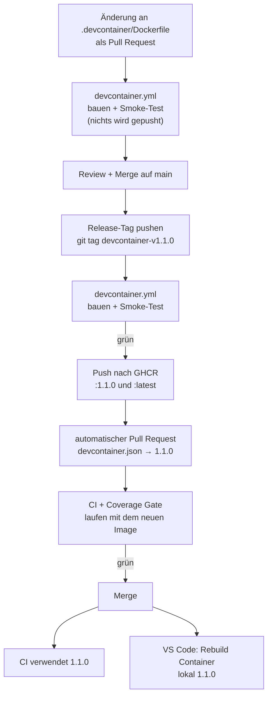

# DevContainer für TicTacTest (M450)

Ein einziges Container-Image ist die Entwicklungsumgebung **lokal in VS Code** und die
Laufzeitumgebung **aller CI-Jobs**. Dieses Dokument beschreibt das Image, seine
Verwendung und den gesamten Versionierungs- und Freigabeprozess.

| Auftrag | Inhalt | Umsetzung |
|---|---|---|
| 1 | DevContainer konfigurieren | [`.devcontainer/Dockerfile`](../.devcontainer/Dockerfile), [`.devcontainer/devcontainer.json`](../.devcontainer/devcontainer.json) |
| 2 | Container mit GH Actions | Image in GHCR, CI-Jobs laufen per `container:` darin |
| 3 | Continuous Deployment des DevContainers | [`devcontainer.yml`](../.github/workflows/devcontainer.yml), [`devcontainer-ref.yml`](../.github/workflows/devcontainer-ref.yml) |

Image: **`ghcr.io/thegloo/450-tictactest-mvk`** (öffentlich)

---

## 1. Das Image (Auftrag 1)

[`.devcontainer/Dockerfile`](../.devcontainer/Dockerfile), Basis
**`azul/zulu-openjdk-alpine:25`** (Alpine Linux):

| Bestandteil | Details |
|---|---|
| **Java 25** | Azul Zulu, also genau der Hersteller, auf den der Gradle-Daemon gepinnt ist (`gradle/gradle-daemon-jvm.properties`). Gradle lädt keine Toolchain herunter. |
| **Gradle** | Die Distribution des Wrappers (`9.7.0`) ist vorab im Image und zusätzlich als `gradle` im `PATH`. Alle Projekt-Abhängigkeiten (JUnit, AssertJ, JaCoCo) liegen bereits im Cache `GRADLE_USER_HOME=/opt/gradle-home`. |
| **JUnit** | JUnit 5 über Gradle; zusätzlich der *JUnit Platform Console Launcher* als Befehl `junit` |
| **Benutzer** | `dev` mit **UID:GID 1000:1000**, Standardbenutzer des Images |
| **Werkzeuge** | `bash`, `git`, `ssh`, `curl`, `gh` (GitHub CLI) |
| **für VS Code / Actions** | `libstdc++` und `libgcc` (VS Code Server und das Node.js des Runners auf musl), GNU `tar` + `zstd` (Cache von `actions/cache`) |

Der Build-Kontext ist das Projektwurzelverzeichnis, weil der Gradle-Wrapper und die
Build-Dateien ins Image kopiert werden:

```bash
docker build -f .devcontainer/Dockerfile -t tictactest-devcontainer .
```

> Das Base-Image lässt sich später wechseln (z. B. auf Ubuntu). Dann ändern sich
> `FROM`, `apk` → `apt-get` und `addgroup/adduser` → `groupadd/useradd`. Nach dem
> Versionierungskonzept (Kapitel 4) ist das eine neue **Major**-Version.

### devcontainer.json

[`.devcontainer/devcontainer.json`](../.devcontainer/devcontainer.json):

| Einstellung | Wert |
|---|---|
| `image` | freigegebene Version, z. B. `ghcr.io/thegloo/450-tictactest-mvk:1.0.0`, siehe Kapitel 3 |
| `remoteUser` / `containerUser` | `dev` (1000:1000) |
| Extensions | `vscjava.vscode-java-pack` (Java, Debugger, Test Runner, Maven), `vscjava.vscode-gradle`, `ryanluker.vscode-coverage-gutters` (zeigt den JaCoCo-Report im Editor), `github.vscode-github-actions`, `bierner.markdown-mermaid` (Diagramme in den Docs) |
| `postCreateCommand` | `./gradlew --version` |

**Verwenden:** Repository in VS Code öffnen → *Reopen in Container* (Extension
*Dev Containers* und Docker müssen lokal installiert sein).

**Dockerfile lokal testen:** In `devcontainer.json` die Zeile `"image"` durch den
auskommentierten `"build"`-Block ersetzen, dann *Rebuild Container*. Diese Änderung
wird nicht committet, die freigegebene Version bleibt `image`.

> Laut Auftrag werden `devcontainer.json` und `Dockerfile` am Ende in **beide**
> Repositories der 2er-Gruppe kopiert, damit alle dieselbe Umgebung haben.

---

## 2. Container in GitHub Actions (Auftrag 2)

Alle Jobs, die bauen oder testen, laufen im Image aus der GitHub Container Registry:

| Workflow | Jobs im DevContainer |
|---|---|
| [`ci.yml`](../.github/workflows/ci.yml) | *Build, Test & Coverage* |
| [`coverage-gate.yml`](../.github/workflows/coverage-gate.yml) | *Coverage main*, *Coverage branch* |
| [`release.yml`](../.github/workflows/release.yml) | *Build & Publish Release* |

```yaml
jobs:
  image:
    uses: ./.github/workflows/devcontainer-ref.yml   # liest "image" aus devcontainer.json
  build:
    needs: image
    runs-on: ubuntu-latest
    container:
      image: ${{ needs.image.outputs.image }}
      options: --user root   # der Runner hängt den Workspace mit seiner eigenen UID ein
```

`--user root` ist nötig, weil der Runner das Workspace-Verzeichnis mit seiner eigenen
UID einhängt. Lokal arbeitet man als `dev`.

---

## 3. Continuous Deployment (Auftrag 3)

### Eine Stelle für die Version

Die verwendete Version steht **nur** in `.devcontainer/devcontainer.json`:

```jsonc
"image": "ghcr.io/thegloo/450-tictactest-mvk:1.0.0",
```

- **Lokal** liest VS Code diese Zeile.
- **In der CI** liest der wiederverwendbare Workflow
  [`devcontainer-ref.yml`](../.github/workflows/devcontainer-ref.yml) dieselbe Zeile
  und gibt sie an die Jobs weiter (`container: image: ${{ needs.image.outputs.image }}`).

Damit können lokale Umgebung und CI nie auseinanderlaufen, und eine neue Version
braucht genau eine geänderte Zeile. Das ist auch technisch nötig: Ein Workflow darf
mit dem `GITHUB_TOKEN` keine Dateien unter `.github/workflows/` ändern. Stünde die
Version dort, könnte der automatische Pull Request sie nicht anpassen.

### Ablauf



**Schritt für Schritt, eine neue Version veröffentlichen:**

1. `Dockerfile` ändern, Pull Request eröffnen. Der Workflow *DevContainer* baut das
   Image und führt den Smoke-Test aus. **Es wird nichts veröffentlicht.**
2. Nach dem Review mergen.
3. Auf `main` die neue Version taggen und pushen:

   ```bash
   git switch main && git pull
   git tag devcontainer-v1.1.0
   git push origin devcontainer-v1.1.0
   ```

4. Der Workflow *DevContainer*
   - prüft das Tag-Format `devcontainer-vMAJOR.MINOR.PATCH`,
   - bricht ab, wenn diese Version in GHCR schon existiert,
   - baut das Image und führt den **Smoke-Test** aus: `java`, `gradle`, `junit`,
     `git`, `gh` vorhanden, Standardbenutzer ist `1000:1000`, und das Projekt baut
     inklusive aller Tests (`./gradlew build`) im Image,
   - pusht **nur bei grünem Smoke-Test** `:1.1.0` und `:latest`,
   - erstellt den Pull Request **„DevContainer auf Version 1.1.0 aktualisieren"**
     (Branch `devcontainer/bump-1.1.0`), der `devcontainer.json` umstellt,
   - startet für diesen Branch **CI** und **Coverage Gate**. Pull Requests, die mit
     dem `GITHUB_TOKEN` erstellt werden, lösen selbst keine Workflows aus; ein
     `workflow_dispatch` hingegen schon.
5. Sind die Checks grün, den Pull Request mergen. Ab dann
   - verwenden **alle CI-Jobs** automatisch die neue Version,
   - bietet VS Code beim nächsten Öffnen (bzw. nach `git pull`) *Rebuild Container*
     an und zieht die neue Version.

---

## 4. Versionierungskonzept

Die Images werden nach **Semantic Versioning** `MAJOR.MINOR.PATCH` versioniert. Die
Version entsteht ausschliesslich aus einem Git-Tag `devcontainer-vX.Y.Z`.

| Teil | wird erhöht bei | Beispiele |
|---|---|---|
| **MAJOR** | inkompatiblen Änderungen | Base-Image Alpine → Ubuntu, neue Java-Major-Version, anderer Benutzer/UID |
| **MINOR** | neuen Funktionen, abwärtskompatibel | zusätzliches Werkzeug, neue VS-Code-Extension, neue Gradle-Minor-Version |
| **PATCH** | Korrekturen ohne neue Funktion | Neubau für Sicherheitsupdates, Bugfix im Dockerfile |

Das Präfix `devcontainer-` trennt diese Tags von den Tags der Anwendung (`v1.0.0`,
Workflow `release.yml`). Die beiden Release-Prozesse stören sich nicht.

| Image-Tag | Bedeutung | wird verwendet von |
|---|---|---|
| `:X.Y.Z` | freigegebene Version, **unveränderlich** | `devcontainer.json` → CI und lokal |
| `:latest` | zeigt immer auf die neueste freigegebene Version | nur zur Information / manuellem Test |
| `:<commit-sha>` | Altlast aus Auftrag 2 (Ubuntu-Image), nicht mehr verwendet | – |

### Wie verhindert wird, dass unfreigegebene Images verwendet werden

1. **Nur Release-Tags veröffentlichen.** Builds aus Pull Requests und von `main`
   werden gebaut und getestet, aber nie in die Registry gepusht. Ein ungetestetes
   oder nicht getaggtes Image existiert in GHCR gar nicht.
2. **Nur getestete Images werden gepusht.** Der Push-Schritt läuft erst nach dem
   grünen Smoke-Test, der das Projekt vollständig im Image baut und testet.
3. **Versionen sind unveränderlich.** Existiert `:X.Y.Z` schon, bricht der Workflow ab.
   Eine einmal freigegebene Version kann nicht nachträglich ausgetauscht werden.
4. **Feste Versionen statt `latest`.** CI und VS Code verwenden die exakte Version aus
   `devcontainer.json`, nie `:latest`.
5. **Freigabe per Pull Request.** Eine neue Version wird erst verwendet, wenn der
   automatisch erstellte Pull Request mit grüner CI (die bereits im neuen Image läuft)
   gemergt wurde. Der Merge ist die Freigabe.

---

## 5. Einmalige Einstellungen im Repository

| Einstellung | Wo | Wozu |
|---|---|---|
| **Allow GitHub Actions to create and approve pull requests** | *Settings → Actions → General → Workflow permissions* | damit der Workflow den Versions-Pull-Request erstellen darf |
| Paket **öffentlich** | *Profil → Packages → 450-tictactest-mvk → Package settings* | lokal ziehen ohne `docker login` (ist bereits öffentlich) |

---

## Anhang: Image von Hand bauen und hochladen

Nur für Notfälle, der normale Weg ist der Release-Tag (Kapitel 3). Ein PAT mit
`write:packages` ist nötig:

```bash
docker build -f .devcontainer/Dockerfile -t ghcr.io/thegloo/450-tictactest-mvk:1.0.1 .
echo "$CR_PAT" | docker login ghcr.io -u TheGloo --password-stdin
docker push ghcr.io/thegloo/450-tictactest-mvk:1.0.1
```

> Der Image-Name muss klein geschrieben sein (`TheGloo` → `thegloo`).
