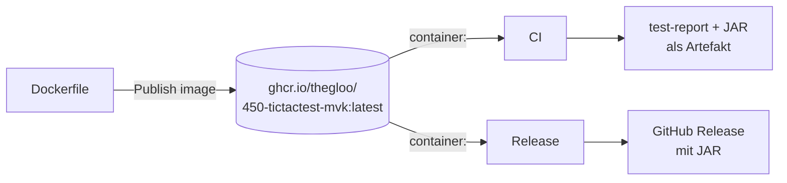

# Pipelines – Übersicht (M450)

Dokumentation aller GitHub-Actions-Workflows im Projekt `450-tictactest-mvk`,
Stand **09.09.2026**. Beschrieben ist der IST-Zustand der Dateien unter
[`.github/workflows/`](../.github/workflows/).

---

## Überblick

| # | Pipeline | Datei | Auslöser | Ergebnis |
|---|---|---|---|---|
| 1 | **CI** | [`ci.yml`](../.github/workflows/ci.yml) | Push / PR auf `main`, manuell | Build + gesamte Testsuite, Testreport und JAR als Artefakt |
| 2 | **Release** | [`release.yml`](../.github/workflows/release.yml) | Push eines Tags `v*` | GitHub Release mit angehängtem JAR |
| 3 | **Publish image** | [`publish-image.yml`](../.github/workflows/publish-image.yml) | Änderung am Dockerfile/Wrapper, manuell | Container-Image in der GitHub Container Registry |

### Zusammenspiel

**Publish image** ist die Basis der beiden anderen: Es erzeugt das Image, in dem
CI und Release laufen. Liegt das Image nicht in der Registry, scheitern beide
beim Ziehen des Containers.

---

## 1. CI

Baut das Projekt und führt die gesamte Testsuite aus. Das Qualitätstor für jeden
Push und jeden Pull Request.

| Eigenschaft | Wert |
|---|---|
| **Datei** | [`.github/workflows/ci.yml`](../.github/workflows/ci.yml) |
| **Workflow-Name** | `CI` |
| **Job** | `build` – *Build & Test* |
| **Auslöser** | `push` auf `main`, `pull_request` auf `main`, `workflow_dispatch` (manuell) |
| **Runner** | `ubuntu-latest` |
| **Container** | `ghcr.io/thegloo/450-tictactest-mvk:latest`, Login per `github.actor` + `GITHUB_TOKEN` |
| **Berechtigungen** | `contents: read`, `packages: read` |
| **Secrets** | nur das eingebaute `GITHUB_TOKEN` |
| **Hauptbefehl** | `./gradlew build --stacktrace` |
| **Laufzeit** | ca. 1–2 Minuten |
| **Fehlerverhalten** | ein fehlgeschlagener Test färbt den Lauf rot und blockiert den PR |

**Schritte**

1. `actions/checkout@v4` – Repository auschecken
2. `gradle/actions/setup-gradle@v4` – Gradle-Caching (JDK und Gradle-Distribution
   kommen bereits aus dem Container-Image, ein `setup-java`-Schritt entfällt)
3. `./gradlew build --stacktrace` – kompilieren, testen, JAR bauen
4. `actions/upload-artifact@v4` – Artefakt **`test-report`** aus
   `build/reports/tests/test` (mit `if: always()`, also auch bei roten Tests;
   `if-no-files-found: ignore`)
5. `actions/upload-artifact@v4` – Artefakt **`tictactoe-jar`** aus
   `build/libs/*.jar` (`if-no-files-found: error`)

**Artefakte**

- `test-report` – der HTML-Testreport, auch bei fehlgeschlagenem Build
- `tictactoe-jar` – das gebaute, lauffähige JAR

---

## 2. Release

Veröffentlicht eine Version, sobald ein Versions-Tag gepusht wird.

| Eigenschaft | Wert |
|---|---|
| **Datei** | [`.github/workflows/release.yml`](../.github/workflows/release.yml) |
| **Workflow-Name** | `Release` |
| **Job** | `release` – *Build & Publish Release* |
| **Auslöser** | `push` eines Tags nach dem Muster `v*` (z. B. `v1.0.0`) |
| **Runner** | `ubuntu-latest` |
| **Container** | `ghcr.io/thegloo/450-tictactest-mvk:latest` (identisch zur CI) |
| **Berechtigungen** | `contents: write` (Release anlegen), `packages: read` (Image ziehen) |
| **Secrets** | `GITHUB_TOKEN` – für den Registry-Login und als `GH_TOKEN` für die `gh`-CLI |
| **Hauptbefehl** | `./gradlew build -Pversion="$VERSION"` |
| **Laufzeit** | ca. 1–2 Minuten |
| **Fehlerverhalten** | schlägt ein Test fehl, entsteht kein Release |

**Schritte**

1. `actions/checkout@v4` – Repository auschecken
2. `gradle/actions/setup-gradle@v4` – Gradle-Caching
3. **Version aus dem Tag ableiten** – `VERSION=${GITHUB_REF_NAME#v}` schneidet das
   führende `v` ab und legt den Wert in `$GITHUB_ENV` ab (`v1.2.3` → `1.2.3`)
4. `./gradlew build -Pversion="$VERSION" --stacktrace` – JAR mit Versionsnummer bauen
5. **GitHub Release erstellen** – `gh release create` mit dem JAR als Anhang,
   dem Tag als Titel und `--generate-notes` für automatische Release Notes

**Ergebnis** – ein GitHub Release unter dem Tag-Namen, mit angehängtem JAR und
generierten Release Notes.

> Die `gh`-CLI ist Teil des Container-Images (siehe [CONTAINER.md](CONTAINER.md)),
> weil das Basis-Image `azul/zulu-openjdk:25` sie nicht mitbringt.

---

## 3. Publish image

Baut das Container-Image aus dem `Dockerfile` und lädt es in die GitHub Container
Registry. Grundlage für die beiden anderen Pipelines.

| Eigenschaft | Wert |
|---|---|
| **Datei** | [`.github/workflows/publish-image.yml`](../.github/workflows/publish-image.yml) |
| **Workflow-Name** | `Publish image` |
| **Job** | `publish` – *Build & push image* |
| **Auslöser** | `workflow_dispatch` (manuell) und `push` auf `main`, aber nur bei Änderungen an `Dockerfile`, `.dockerignore`, `gradlew`, `gradle/wrapper/**` oder der Workflow-Datei selbst |
| **Runner** | `ubuntu-latest` (kein Container – hier wird das Image ja erst gebaut) |
| **Berechtigungen** | `contents: read`, **`packages: write`** |
| **Secrets** | nur `GITHUB_TOKEN` – **kein Personal Access Token nötig** |
| **Registry** | `ghcr.io` |
| **Laufzeit** | ca. 2–4 Minuten beim ersten Lauf, danach deutlich weniger dank Cache |

**Schritte**

1. `actions/checkout@v4` – Repository auschecken
2. `docker/setup-buildx-action@v3` – Buildx-Builder mit `docker-container`-Treiber;
   nötig, weil der Standard-`docker`-Treiber keinen Cache exportieren kann
3. `docker/login-action@v3` – Anmeldung an `ghcr.io` mit `GITHUB_TOKEN`
4. `docker/build-push-action@v6` – Image bauen und pushen

**Erzeugte Tags**

| Tag | Zweck |
|---|---|
| `ghcr.io/thegloo/450-tictactest-mvk:latest` | wird von CI und Release referenziert |
| `ghcr.io/thegloo/450-tictactest-mvk:<commit-sha>` | unveränderlicher Stand für die Nachvollziehbarkeit |

**Build-Cache** – `cache-from: type=gha` und `cache-to: type=gha,mode=max` legen die
Layer im GitHub-Actions-Cache ab, sodass Folge-Builds nur geänderte Schichten neu bauen.

---

## Gemeinsame Eigenschaften

### Verwendete vorgefertigte Actions

| Action | Version | Eingesetzt in |
|---|---|---|
| `actions/checkout` | `v4` | alle drei |
| `actions/upload-artifact` | `v4` | CI |
| `gradle/actions/setup-gradle` | `v4` | CI, Release |
| `docker/setup-buildx-action` | `v3` | Publish image |
| `docker/login-action` | `v3` | Publish image |
| `docker/build-push-action` | `v6` | Publish image |

### Laufzeitumgebung

- Alle Jobs laufen auf **von GitHub gehosteten** `ubuntu-latest`-Runnern; es gibt
  keine Self-hosted Runner.
- CI und Release laufen zusätzlich **im projekteigenen Container-Image** mit
  Zulu 25 (der in `gradle/gradle-daemon-jvm.properties` gepinnten JVM), der
  vorab entpackten Gradle-Distribution sowie `git` und `gh`.
- Dadurch entfällt in beiden Workflows der Schritt `actions/setup-java`, und die
  lokal wie in der CI verwendete JDK-Version ist garantiert identisch.

### Berechtigungen und Secrets

- Jeder Workflow deklariert `permissions` explizit und nach dem Prinzip der
  minimalen Rechte: nur `publish-image` besitzt `packages: write`, nur `release`
  besitzt `contents: write`.
- Es wird **ausschliesslich das eingebaute `GITHUB_TOKEN`** verwendet. Im Repository
  sind keine eigenen Secrets hinterlegt, und es ist kein Personal Access Token nötig.

### Bekannte Abhängigkeit

CI und Release setzen voraus, dass `ghcr.io/thegloo/450-tictactest-mvk:latest` in
der Registry existiert. Beim allerersten Mal – und nach einer Änderung am
`Dockerfile` – muss deshalb **`Publish image` zuerst grün durchlaufen**; ein
parallel gestarteter CI-Lauf kann noch mit `manifest unknown` scheitern und wird
anschliessend per *Re-run* wiederholt.

### Nicht vorhanden

Der Vollständigkeit halber: Es gibt heute **keine** Workflows für Deployment in eine
Laufzeitumgebung, für Code-Coverage-Reports, für statische Analyse/Linting, für
Dependency-Scanning und keine geplanten (`schedule`-) Läufe.

---

## Mitgeltende Dokumente

| Dokument | Inhalt |
|---|---|
| [CONTAINER.md](CONTAINER.md) | Aufbau des Container-Images und Anleitung zum Bauen/Hochladen |
| [TESTKONZEPT.md](TESTKONZEPT.md) | Teststrategie, Testziele und Testfälle, die die CI ausführt |
| [TESTDOKUMENTATION.md](TESTDOKUMENTATION.md) | GIVEN/WHEN/THEN je Testfall, Testprotokolle |

Alle Workflow-Läufe: <https://github.com/TheGloo/450-tictactest-mvk/actions>
