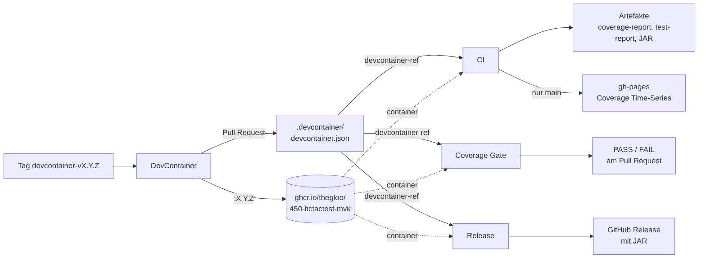

# Pipelines – Übersicht (M450)

Dokumentation aller GitHub-Actions-Workflows im Projekt `450-tictactest-mvk`,
Stand **22.09.2026**. Beschrieben ist der IST-Zustand der Dateien unter
[`.github/workflows/`](../.github/workflows/).

---

## Überblick

| # | Pipeline | Datei | Auslöser | Ergebnis |
|---|---|---|---|---|
| 1 | **CI** | [`ci.yml`](../.github/workflows/ci.yml) | Push auf jeden Branch, PR auf `main`, manuell | Build + Tests + Coverage; Artefakte `coverage-report`, `test-report`, `tictactoe-jar`; auf `main` zusätzlich die Coverage Time-Series auf GitHub Pages |
| 2 | **Coverage Gate** | [`coverage-gate.yml`](../.github/workflows/coverage-gate.yml) | PR auf `main` geöffnet/aktualisiert, manuell | PASS/FAIL: Coverage des Branches ≥ Coverage von `main` |
| 3 | **Release** | [`release.yml`](../.github/workflows/release.yml) | Push eines Tags `v*` | GitHub Release mit angehängtem JAR |
| 4 | **DevContainer** | [`devcontainer.yml`](../.github/workflows/devcontainer.yml) | Änderung am Image (PR, `main`), Tag `devcontainer-v*` | getestetes Image; bei einem Tag: veröffentlichte Version in GHCR + Pull Request, der sie einsetzt |
| – | *DevContainer image reference* | [`devcontainer-ref.yml`](../.github/workflows/devcontainer-ref.yml) | nur `workflow_call` | liefert den übrigen Workflows das Image aus `devcontainer.json` |

### Zusammenspiel

Die Version des Images steht **nur** in `.devcontainer/devcontainer.json`. CI,
Coverage Gate und Release lesen sie über `devcontainer-ref.yml` von dort. Details
und Freigabeprozess: [DEVCONTAINER.md](DEVCONTAINER.md). Coverage-Konzept:
[COVERAGE.md](COVERAGE.md).

---

## 1. CI

Baut das Projekt, führt die Testsuite aus, misst die Coverage und veröffentlicht
auf `main` die Coverage Time-Series.

| Eigenschaft | Wert |
|---|---|
| **Datei** | [`.github/workflows/ci.yml`](../.github/workflows/ci.yml) |
| **Auslöser** | `push` auf jeden Branch ausser `gh-pages`, `pull_request` auf `main`, `workflow_dispatch` |
| **Berechtigungen** | `contents: read`, `packages: read`; Job `coverage-pages` zusätzlich `contents: write` |
| **Secrets** | nur das eingebaute `GITHUB_TOKEN` |

**Jobs**

| Job | Läuft in | Aufgabe |
|---|---|---|
| `image` – *DevContainer image* | `ubuntu-latest` | liest die Image-Version aus `devcontainer.json` |
| `build` – *Build, Test & Coverage* | DevContainer-Image (`--user root`) | `./gradlew build` (Tests + JaCoCo), Coverage-Tabelle in der Zusammenfassung, Artefakte hochladen; Output `coverage` (Line Coverage) |
| `coverage-pages` – *Coverage time series* | `ubuntu-latest`, **nur bei Push auf `main`** | Artefakt `coverage-report` laden, eigene Action `coverage-timeseries` aufrufen → Zeile an `coverage-history.csv` auf `gh-pages` anhängen, Report + Seite aktualisieren, pushen |

**Artefakte**

- `coverage-report` – HTML-Report von JaCoCo
- `test-report` – HTML-Testreport, auch bei roten Tests (`if: always()`)
- `tictactoe-jar` – das gebaute, lauffähige JAR

`coverage-pages` hat eine `concurrency`-Gruppe ohne Abbruch: Zwei schnelle Pushes
auf `main` schreiben nacheinander, keine Messung geht verloren.

---

## 2. Coverage Gate

Qualitätstor für Pull Requests: **Ein Branch darf keine tiefere Test Coverage
haben als der aktuelle `main`-Branch.**

| Eigenschaft | Wert |
|---|---|
| **Datei** | [`.github/workflows/coverage-gate.yml`](../.github/workflows/coverage-gate.yml) |
| **Auslöser** | `pull_request` auf `main` (`opened`, `synchronize`, `reopened`), `workflow_dispatch` |
| **Berechtigungen** | `contents: read`, `packages: read` |
| **Nebenläufigkeit** | ein neuer Push auf denselben PR bricht den laufenden Check ab |

**Jobs**

| Job | Aufgabe |
|---|---|
| `image` | Image-Version aus `devcontainer.json` |
| `main` – *Coverage main* | checkt `main` aus, `./gradlew test jacocoTestReport` mit dem Init-Script `jacoco.init.gradle`, Output `coverage` |
| `branch` – *Coverage branch* | dasselbe für den PR (Merge-Commit) bzw. den manuell gewählten Branch |
| `compare` – *Compare (PASS / FAIL)* | gibt main, Branch, Differenz in Prozentpunkten und PASS/FAIL im Log und in der Zusammenfassung aus; schlägt bei FAIL fehl |

`main` und `branch` laufen parallel.

---

## 3. Release

Veröffentlicht eine Version der Anwendung, sobald ein Versions-Tag gepusht wird.

| Eigenschaft | Wert |
|---|---|
| **Datei** | [`.github/workflows/release.yml`](../.github/workflows/release.yml) |
| **Auslöser** | `push` eines Tags nach dem Muster `v*` (z. B. `v1.0.0`) |
| **Container** | DevContainer-Image aus `devcontainer.json` (wie die CI) |
| **Berechtigungen** | `contents: write` (Release anlegen), `packages: read` |

**Schritte:** Checkout → Gradle-Caching → Version aus dem Tag (`v1.2.3` → `1.2.3`)
→ `./gradlew build -Pversion=…` → `gh release create` mit dem JAR und
`--generate-notes`.

Tags `devcontainer-v*` beginnen nicht mit `v` und lösen dieses Release deshalb nicht aus.

---

## 4. DevContainer

Baut, testet und veröffentlicht das Image aus
[`.devcontainer/Dockerfile`](../.devcontainer/Dockerfile).

| Eigenschaft | Wert |
|---|---|
| **Datei** | [`.github/workflows/devcontainer.yml`](../.github/workflows/devcontainer.yml) |
| **Auslöser** | `pull_request` und `push` auf `main`, jeweils nur bei Änderungen an `.devcontainer/**`, `.dockerignore`, Gradle-Wrapper/Build-Dateien oder der Workflow-Datei; `push` eines Tags `devcontainer-v*` |
| **Berechtigungen** | `build`: `contents: read`, `packages: write`; `bump`: `contents: write`, `pull-requests: write`, `actions: write` |
| **Registry** | `ghcr.io/thegloo/450-tictactest-mvk` |

**Job `build` – *Build & test image***

1. bei einem Tag: Version aus `devcontainer-vX.Y.Z` ableiten und prüfen
2. Buildx einrichten (für den `type=gha`-Build-Cache)
3. bei einem Tag: Login an GHCR, Abbruch falls `:X.Y.Z` schon existiert
4. Image bauen (lokal, `load: true`)
5. **Smoke-Test:** `java`, `gradle`, `junit`, `git`, `gh` vorhanden; Standardbenutzer
   `1000:1000`; `./gradlew build` des Projekts im Image grün
6. bei einem Tag: `:X.Y.Z` und `:latest` pushen

**Job `bump` – *Pull request to use the new version*** (nur bei einem Tag)

1. `main` auschecken, in `devcontainer.json` die Version ersetzen
2. `peter-evans/create-pull-request` erstellt den PR (Branch `devcontainer/bump-X.Y.Z`)
3. `gh workflow run` startet **CI** und **Coverage Gate** für den PR-Branch

---

## Gemeinsame Eigenschaften

### Verwendete vorgefertigte Actions

| Action | Version | Eingesetzt in |
|---|---|---|
| `actions/checkout` | `v4` | alle |
| `actions/upload-artifact` | `v4` | CI |
| `actions/download-artifact` | `v4` | CI (`coverage-pages`) |
| `gradle/actions/setup-gradle` | `v4` | CI, Coverage Gate, Release |
| `docker/setup-buildx-action` | `v3` | DevContainer |
| `docker/login-action` | `v3` | DevContainer |
| `docker/build-push-action` | `v6` | DevContainer |
| `peter-evans/create-pull-request` | `v8` | DevContainer |

### Projekteigene Bausteine

| Baustein | Zweck |
|---|---|
| [`.github/actions/coverage-timeseries`](../.github/actions/coverage-timeseries/action.yml) | eigene Composite Action: Coverage-Historie auf `gh-pages` fortschreiben und veröffentlichen |
| [`.github/scripts/coverage.sh`](../.github/scripts/coverage.sh) | Coverage in Prozent aus dem JaCoCo-CSV (CI, Time-Series, Gate rechnen identisch) |
| [`.github/scripts/jacoco.init.gradle`](../.github/scripts/jacoco.init.gradle) | Gradle-Init-Script: gleiche JaCoCo-Konfiguration für `main` und Branch im Gate |

### Berechtigungen und Secrets

- Jeder Workflow deklariert `permissions` explizit und nach dem Prinzip der minimalen
  Rechte; Schreibrechte haben nur die Jobs, die sie brauchen (`coverage-pages`,
  DevContainer `build` und `bump`, `release`).
- Es wird **ausschliesslich das eingebaute `GITHUB_TOKEN`** verwendet, es sind keine
  eigenen Secrets hinterlegt.

### Einmalige Repository-Einstellungen

| Einstellung | Wozu |
|---|---|
| *Settings → Pages →* Source *Deploy from a branch*, Branch `gh-pages` / `(root)` | Coverage Time-Series veröffentlichen |
| *Settings → Actions → General →* **Allow GitHub Actions to create and approve pull requests** | Versions-Pull-Request des DevContainers |

---

## Mitgeltende Dokumente

| Dokument | Inhalt |
|---|---|
| [COVERAGE.md](COVERAGE.md) | JaCoCo, Design und Umsetzung der Coverage Time-Series, Coverage Gate |
| [DEVCONTAINER.md](DEVCONTAINER.md) | DevContainer-Image, Versionierungskonzept, Freigabeprozess |
| [TESTKONZEPT.md](TESTKONZEPT.md) | Teststrategie, Testziele und Testfälle, die die CI ausführt |
| [TESTDOKUMENTATION.md](TESTDOKUMENTATION.md) | GIVEN/WHEN/THEN je Testfall, Testprotokolle |

Alle Workflow-Läufe: <https://github.com/TheGloo/450-tictactest-mvk/actions> ·
Coverage Time-Series: <https://thegloo.github.io/450-tictactest-mvk/>
